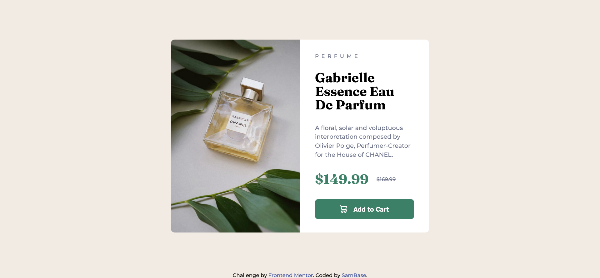

# Frontend Mentor - Product preview card component solution

This is a solution to the [Product preview card component challenge on Frontend Mentor](https://www.frontendmentor.io/challenges/product-preview-card-component-GO7UmttRfa). Frontend Mentor challenges help you improve your coding skills by building realistic projects. 

## Table of contents

- [Overview](#overview)
  - [The challenge](#the-challenge)
  - [Screenshot](#screenshot)
  - [Links](#links)
- [My process](#my-process)
  - [Built with](#built-with)
  - [What I learned](#what-i-learned)
  - [Continued development](#continued-development)
  - [Useful resources](#useful-resources)
- [Author](#author)

**Note: Delete this note and update the table of contents based on what sections you keep.**

## Overview

### The challenge

Users should be able to:

- View the optimal layout depending on their device's screen size
- See hover and focus states for interactive elements

### Screenshot




### Links

- Solution URL: [Add solution URL here](https://your-solution-url.com)
- Live Site URL: [Add live site URL here](https://your-live-site-url.com)

## My process

### Built with

- Semantic HTML5 markup
- CSS custom properties
- Flexbox
- CSS Grid
- Git

### What I learned

Using diffrent images based on display using HTML
```HTML
<picture class="product-image">   
  <source
    srcset="./images/image-product-desktop.jpg"
    media="(min-width: 375px)"
  />
  <source
    srcset="./images/image-product-mobile.jpg"
    media="(min-width: 1px)"
  />
  
</picture>
```

To remove the unexpected gap at the bottom of the image using these rules
```css
.view{
  ...
  display: block;
  margin: auto;
  ...
}
```

### Continued development

Dealing with images when the screen size or parent container size changes.

### Useful resources

- [Responsive Images](https://css-tricks.com/a-guide-to-the-responsive-images-syntax-in-html/) - This helped in changing images when screen size changes, using only HTML tags.

## Author

- GitHub - [@SamBase](https://github.com/SamBase)
- Frontend Mentor - [@SamBase](https://www.frontendmentor.io/profile/SamBase)
